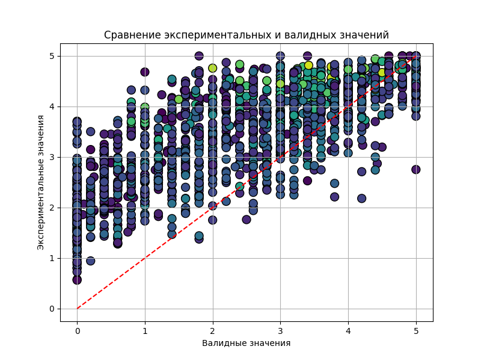
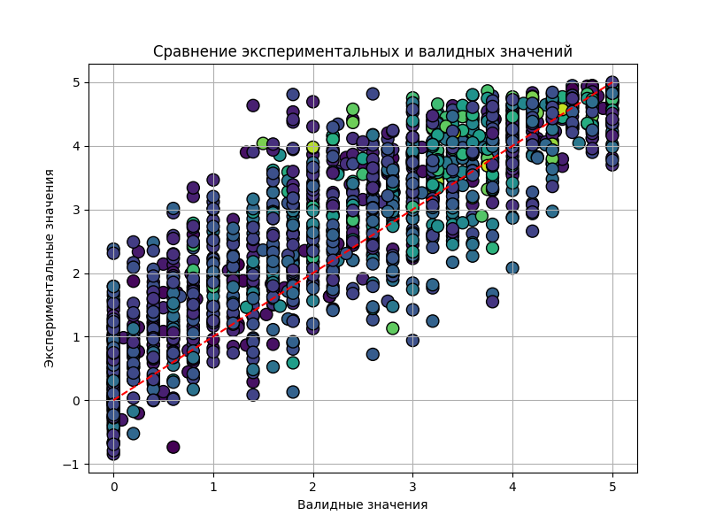

# sentence-embedding

В данном проекте я исследую различные методы создания векторных представлений предложений.

Для анализа используется датасет STSB, который содержит пары предложений и оценку их семантической близости. Я конвертирую эти предложения в вектора и оцениваю их схожесть с помощью косинусного сходства, после чего сравниваю эту оценку с исходными данными из датасета. Косинусное расстояние варьируется от 0 до 1; для удобства сравнения с данными датасета я использую следующую формулу: `result_label = (1 - cosine_distance) * 5`.

До настоящего момента я проверил два подхода:

- Word2Vec
- SentenceTransformers

Хочу проверить, влияет ли размер предложений на точность. Будет интересно сравнить по следущим критериям:

- точность оценки
- точность на разных размерах текста

# word2vector

На этом графике я сравниваю экспериментальные данные с эталонными данными из датасета. Красная пунктирная линия представляет собой идеальное сходство. Темнота точек указывает на длину предложения: чем темнее, тем короче предложение. Исходя из визуального анализа, можно заключить, что длинные сообщения сложнее сравнивать этим методом. Это вероятно связано с тем, что токены слов усредняются, и чем больше слов, тем более средним становится вектор предложения. Кроме того, видно, что данный метод в среднем оценивает предложения как более схожие.

# SentenceTransformer

Этот подход кажется более точным. Здесь точки с большим количеством слов не сконцентрированы в верхней части графика, что позволяет сделать вывод, что SentenceTransformers успешно обрабатывает более длинные предложения по сравнению с Word2Vec.
